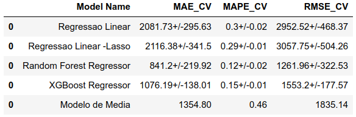
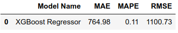

# PROJETO PREVISÃO DE VENDAS ROSSMANN

## O projeto Rossmann 

Este projeto fictício que compõe o meu portfolio profissional busca criar uma solução de negocio que auxiliará o CEO da empresa Rossmann, uma das maiores redes de drogarias existentes na europa, a definir quais lojas da rede ele deve reformar em função da receita de faturamento da drogaria no curto prazo.

O projeto está estruturado nos seguintes passos:

    1. Questão de negócio
    2. Premissas do projeto
    3. Planejamento da solução
    4. Insights obtidos com os dados
    5. Análise e resultados obtidos com o produto proposto
    6. Conclusão do projeto de portfólio
    7. Próximos passos para melhorar o produto

## 1 Questão de negócio

A Dirk Rossmann Gmbh, popularmente conhecida como Rossmann é uma das maiores redes de drogarias existentes na Europa. A empresa possui mais de 4000 lojas localizadas na Alemanha, Polônia, Hungria, Republica Checa, Turquia, Albânia, Kosovo e Espanha. No ano de 2019, o faturamento da Rossmann foi mais de 10 bilhões de euros.

No atual planejamento estratégico da empresa está previsto a implementação de uma nova solução de IOT com o objetivo melhorar a performance da operação das lojas. Tendo em vista essa demanda será necessário reformar as lojas, pois a nova solução requer a instalação de diversos sensores e alterar o lay-out físico de algumas partes das lojas. Além disso, após a reforma e implementação da nova solução estima-se que o custo de operação da loja reduzirá em 6%. A diretoria se reuniu e definiu que na primeira etapa desse processo de modernização um lote de 1115 lojas da rede teriam prioridade, entretanto a ordem de quais lojas serão modernizadas ainda não foi estabelecida. O CEO quer iniciar o processo com apenas 100 lojas e depois implementar no restante das lojas do lote.

### 1.1 Qual o problema de negócio?

O CEO precisa definir quais serão as 100 primeiras lojas que serão reformadas entre as 1115 lojas do primeiro lote. Para tomar esta decisão ele estabeleceu o critério de seleção com base do faturamento previsto nas próximas 6 semanas de cada loja. Entretanto, ele não está muito confiante nas previsões mensais que tem em mãos. Diante da importância desse projeto, o CEO solicitou que uma nova ferramenta de previsão de vendas fosse desenvolvida e que fosse capaz de prever as vendas nas seis próximas semanas. As 100 primeiras lojas selecionadas serão as que tiverem maior faturamento médio nas próximas 6 semanas.

### 1.2 Proposta de solução do problema

A partir dos dados históricos das vendas e das características das 1115 lojas desenvolver um modelo  capaz de realizar a previsão de vendas nas próximas 6 semanas.

## 2 Premissas do projeto

Esse projeto de portfólio foi elaborado utilizado os datasets da competição Rossmann Store Sales existente na plataforma do Kaggle Inc. Ressalta-se que nesse desafio foi disponibilidade um dataset de treino com mais de 1 milhão de linhas e 18 features com informações sobre as vendas diárias de 1115 lojas da rede de drogarias da Rossmann no período de 01/01/2013 a 31/07/2015.

Ressalta-se que esse hipotético projeto de portfólio foi elaborado segundo a experiência do autor e com base nos dados coletados no kaggle. Não sendo possível atestar sobre a veracidade dos dados do dataset e se os mesmos possuem conexão com a realidade.

## 3 Planejamento da solução

### 3.1 Produto proposto

Será desenvolvido um modelo de machine learning capaz de prever as venda das lojas nas próximas 6 semanas, os dados de teste se encontram no dataset teste.csv da competição. O modelo será colocado em produção em ambiente em nuvem e receberá as informação de entrada via requisição em API. Após o calculo da predição uma planilha será enviada para o CEO com as lojas ordenadas do maior para o menor faturamento médio.

Como forma adicional também será disponibilizado para o CEO um bot no aplicativo Telegram capaz de acessar o modelo em produção e assim obter a previsão de vendas das seis próximas semanas partir do número da loja fornecido.

### 3.2 Ferramentas utilizadas

* Python Packages
* Jupyter notebook
* Cloud Heroku
* Aplicativo Telegram

<table>
  <tbody>
    <tr valign="top">
      <td width="25%" align="center">
        Python  
        
      </td>
      <td width="25%" align="center">
        pandas  
        
      </td>
      <td width="25%" align="center">
        NumPy  
        
      </td>
      <td width="25%" align="center">
        SciPy  
        
      </td>
    </tr>
    <tr valign="top">
      <td width="25%" align="center">
        Matplotlib  
        
      </td>
      <td width="25%" align="center">
        seaborn  
        
      </td>
      <td width="25%" align="center">
        scikit-learn  
        
      </td>
      <td width="25%" align="center">
        XGBoost  
        
      </td>
    <tr valign="top">
    </tr>
    <tr valign="top">
    <td width="25%" align="center">
        Flask  
        
      </td>
      <td width="25%" align="center">
        Jupyter  
        
      </td>
      <td width="25%" align="center">
        Heroku  
        
      </td>
      <td width="25%" align="center">
        Telegram Bots  
        
      </td>
    </tr>
  </tbody>
</table>

### 3.3 Processo

O processo utilizado para resolução do problema de negócio segue a metodologia CRIPS-DM. O emprego dessa metodologia nos dá flexibilidade para entregar resultados rápidos e de forma cíclica.

Ao todo a execução da solução do projeto será dividida em 10 passos:

    1.  Coleta e Descrição dos dados
    2.  Feature engineering
    3.  Filtragem dos dados
    4.  Análise exploratória dos dados
    5.  Preparação dos dados
    6.  Seleção de variáveis
    7.  Machine Learning Modeling
    8.  Fine tunining
    9.  Tradução do erro
    10. Deploy do modelo

## 4 Insights obtidos com os dados

Um dos objetivos da Análise Exploratória de Dados ( EDA ) é perceber qual o impacto das variáveis no fenômeno de interesse. Além disso, também é importante perceber quais variáveis podem ser relevantes para o modelo de machine learning. Durante a etapa de EDA desse projeto observou-se alguns alguns insights interessantes durante a análise das hipóteses.

***Abaixo mostramos o mapa mental de hipóteses:***

  

***Hipótese 2: Lojas com competidores mais próximos deveriam vender menos.***

  

Após a investigação desse hipótese verificou-se que lojas com competidores mais próximos vendem mais.

***Hipótese 3: Loja com competidores a mais tempo vendem mais.***

  

A hipótese demonstrou ser falsa e quanto mais tempo existe um competição a tendencia é de queda nas vendas.

***Hipótese 4: Lojas com promoção ativas por mais tempo vendem mais.***

  

Após a EDA chegou-se a conclusão que lojas com promoções ativas por mais tempo vendem menos.

***Hipótese 6: Lojas com mais promoções consecutivas deveriam vender mais.***

  

A hipótese em questão assim como a hipótese 4 demonstrou ser falsa.

***Hipótese 8: Lojas deveriam vender menos durante os feriados escolares.***

  

Após a EDA verificou-se que as vendas no período de feriado escolar foram bastante significativas nos meses de julho e agosto quando comparado com as vendas em dias normais. Entretanto, convém mencionar que as vendas em volume nesses meses são menores.

***Variável "customers"***

  

Durante a etapa de filtragem de variáveis constatou-se que a variável "customers" possui uma forte correlação com a variável resposta vendas. Convém mencionar que essa variável não pode ser utilizada, pois não é possível prever quantos clientes estarão na loja no período de previsão existente no dataset de teste.

## 5 Análise e resultados obtidos com o produto proposto

### 5.1 Análise e resultados obtidos com o modelo

Neste projeto foram utilizados cinco diferentes modelos de machine learning para prever as vendas das lojas com base nos seus respectivos históricos.

* Modelo de média
* Modelo de Regressão linear
* Modelo de Regressão linear regularizada - Lasso
* Random Forest Regressor
* Xgboost Regressor

Abaixo destacamos as performances desses modelos antes de realizar o Cross Validation:

  

As métricas utilizadas para avaliar a performances dos modelos foram:

* MAE  - Mean Absolut Error (Erro absoluto médio)
* MAPE - Mean Absolut Percentage Error (Erro absoluto médio percentual)
* RMSE - Root Mean Squared Error (Raiz quadrada do erro quadrático médio )

O processo de validação cruzada do nosso problema de negócio deve respeitar o aspecto temporal das vendas das lojas com o decorrer do tempo. Sendo assim, foi empregada a técnica de time series cross validation e o dataset foi dividido em 5 folds. Convém mencionar que o período temporal estabelecido para o intervalo de validação foi de seis semanas.

  

Os modelos alcançaram as seguintes performances após o time series cross validation:

  

O critério para analisar a performance geral dos modelos após o time series cross validation foi calcular a médias e os desvios padrão dos resultados obtidos nos 5 folds.

Uma observação interessante é que o modelo de média teve uma performance superior aos modelos de regressão linear e regressão linear regularizada, tendo em vista os respectivos MAE e RMSE. Nesse primeiro ciclo do CRISP-DM observa-se que pode haver a possibilidade de existir um comportamento não linear entre as variáveis do conjunto de dados e a variável resposta ou que algumas variáveis utilizadas para treinar os modelos estão comprometendo a performance desses modelos lineares.

O modelo Random Forest Regressor apresentou a melhor performance entre os modelos nesse primeiro ciclo do CRISP-DM. Convém mencionar o modelo XGBoost teve um performance muito próxima o que também o torna um bom candidato a ser escolhido no primeiro ciclo do CRIPS-DM, tendo em vista que Random Forest Regressor exige mais tempo de treinamento e requer mais recursos computacionais e de armazenamento para o modelo treinado. Diante disso, o modelo XGBoost foi o modelo selecionado para realizar as previsões de negócio nesse primeiro ciclo.

### 5.2 Performance após Fine Tuning dos hiperparâmetros
O método utilizado para a realizar a otimização dos hiperparâmetros do modelo foi o random search. Os parâmetros utilizados foram:
* eta
* max_depth
* min_child_weight
* subsample
* colsample_bytree
* n_estimators

A performance após o Fine Tuning Hyperparameters apresentou os seguintes valores:

  

### 5.3 Business Performance
Um importante papel que o cientista de dados deve exercer é traduzir a performance obtida na modelagem de machine learning em resultados de negócios. A métrica MAE foi a balizadora para a construção dos melhores e piores cenários da performance de negócio de cada loja. Abaixo encontra-se a performances das lojas 1 a 5 .

  

Ressalta-se que cada loja possui uma performance distinta com relação a performance geral do modelo.

Observações referente a Loja 1:
* A previsão de vendas relativa as seis semanas corresponde a $168.687,34.

* O MAE da loja que foi acumulado durante as seis semanas corresponde a $ 11.574,96.

* O pior cenário consiste na soma das previsões diárias ***menos*** a soma dos MAE da loja do período, o que corresponde ao faturamento de $157.112,39.

* O melhor cenário de previsão do faturamento consiste na soma das previsões diárias ***mais*** a soma dos MAE da loja relativos as seis semanas, o que totaliza $180.262,30.

* O mape da loja é igual a 7,2 % o que corresponde a uma diferença de - 4,3 % comparado com o mape geral do modelo.

### 5.4 Machine Learning Performance

O erro médio percentual do modelo corresponde a -1,76% o que indica que o modelo tende a superestimar os valores preditos. A seguir mostramos o gráfico de dispersão do erro com relação aos valores preditos.

  

O Histograma da distribuição do erro apresentou o seguinte comportamento:

  

Observando a evolução das vendas e das predições com o decorrer das seis semanas constata-se que as previsões de modo geral seguem o padrão de comportamento das vendas.

  

Algumas lojas específicas o modelo demonstrou não ser capaz de prever de forma adequada conforme observa-se no gráfico da dispersão do mape de cada loja, bem como no gráfico da taxa de erro (valores preditos / vendas ):

  

  

### 5.5 Deploy do modelo

O deploy do modelo foi publicado no heroku cloud e a API foi construída usando o pacote Flask do python. Abaixo temos um diagrama da arquitetura da solução implementada:

  

Após o deploy no Heroku qualquer dispositivo/usuário será capaz de obter as previsões de vendas das próximas seis semanas das lojas via API.

### 5.6 Bot no Telegram App

Um dos objetivos desse projeto é construir um bot no aplicativo Telegram capaz de permitir que o CEO acesse as previsões das lojas na palma da sua mão. Abaixo temos um diagrama da arquitetura da solução implementada:

  

A seguir mostramos o BOT Telegram em funcionamento:

* Digite o número da loja na qual deseja a previsão de vendas nas próximas 6 semanas.
* Se digitar um texto o Bot Telegram retorna a mensagem "Store id is wrong"
* Se digitar um número de uma loja que não existe no dataset test.csv o Bot Telegram retorna a mensagem "Store not available".

  

## 6 Conclusão do projeto de portfólio

Após todo o desenvolvimento desse primeiro ciclo desse projeto (CRISP-DM), os dois produtos de dados propostos como solução do problema de negócio da Rossmann conseguiram alcançar os objetivos desejados. O modelo de machine learning mostrou-se capaz de prever as vendas das seis próximas semanas das lojas existentes no dataset test.csv da competição do Kaggle. O Bot disponibilizado para o CEO no aplicativo Telegram permite o acesso ao modelo em produção e assim obter a previsão de vendas da loja desejada na palma da mão. Ambos os produtos de dados auxiliam o CEO da Rossmann a tomar decisões estratégicas sobre quais lojas podem ser reformadas primeiro para implantação da solução IOT conforme o planejamento estratégico da empresa.

## 7 Próximos passos para melhorar os produtos

Após a primeira entrega é possível seguir por vários caminhos distintos nos próximos ciclos do CRISP-DM. Geralmente essa decisão poderá ser pautada por novas demandas vinda do CEO ou em função da motivação da equipe de ciencia de dados.

Destacamos as seguintes possibilidades de caminhos:

* Construir um dashboard para apresentação para a diretoria.

* Pesquisar novas variáveis macroeconômicas que podem ser utilizadas para treinar o modelo.

* Pesquisar novas variáveis climáticas que podem ser utilizadas para treinar o modelo.

* Melhorar a experiência do usuário do Bot Telegram.

* Nesse projeto não foi possível utilizar a variável 'customer' (número de clientes) existente no dataset de treino, pois não era possível prever o número de clientes no dia da venda da loja. Ressalta-se que a variável 'customer' apresentou uma alta correlação com variável vendas. Sendo assim, no próximo ciclo pode-se construir um modelo para prever quantos clientes frequentarão as lojas e usar essa predição como uma nova variável a ser utilizada para treinar o modelo de previsão de vendas.

* Melhorar a performance do modelo XGBoost através de um nova análise exploratória de dados, focando as lojas que obtivem valores maiores de MAPE.

* Construir novas hipóteses de negócios com objetivos de entender o comportamento das lojas que obtiveram maiores valores de MAPE.

* Realizar Hyperparameter Fine Tuning no modelo Random Forest Regressor, pois apresentou performance um pouco superior ao XGBoost.

* Realizar uma nova análise exploratória de dados com o objetivo de entender quais variáveis comprometeram de forma significativa as performances dos modelos de regressão linear e regressão lasso.

* Testar outros modelos de machine learning com objetivo de melhorar a performance.

### Autor

Deivison Morais. Visite o meu portfólio de projetos [aqui.](https://deivison1983.github.io/portfolio_projetos/)

### Contatos

  
  

