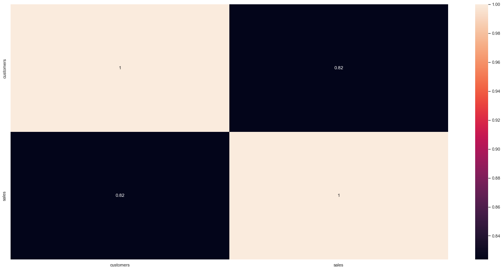

# ROSSMANN SALES FORECAST PROJECT

# 
🇧🇷 [Versão em Português](https://github.com/deivison1983/sales_forecast_rossmann_stores)

## The Rossmann project 

This project that composes my professional portfolio seeks to create a business solution that will help the CEO of Rossmann, one of the largest drugstore chains in Europe, to define which stores in the chain he should renovate depending on the drugstore's revenue in the short term.

The project is structured in the following steps:

 1. Business question
 2. Project Assumptions
 3. Solution planning
 4. Insights gained from the data
 5. Analysis and results obtained with the proposed product
 6. Conclusion the portfolio project
 7. Next steps to improve the product

## 1 Business question

Dirk Rossmann Gmbh, popularly known as Rossmann is one of the largest drugstore chains in Europe. The company has more than 4000 stores located in Germany, Poland, Hungary, Czech Republic, Turkey, Albania, Kosovo and Spain. In 2019, Rossmann's turnover was more than 10 billion euros.

The company's current strategic planning includes the implementation of a new IOT solution with the objective of improving the performance of the stores' operations. In view of this demand, it will be necessary to renovate the stores, as the new solution requires the installation of several sensors and changing the physical layout of some parts of the stores. Furthermore, after the renovation and implementation of the new solution, it is estimated that the cost of operating the store will be reduced by 6%. The board met and defined that in the first stage of this modernization process, a batch of 1115 stores in the chain would have priority, however the order of which stores will be modernized has not yet been established. The CEO wants to start the process with just 100 stores and then roll it out to the rest of the stores on the lot.

### 1.1 What is the business problem?

The CEO needs to define which will be the first 100 stores that will be renovated among the 1115 stores of the first batch. To make this decision, he established the selection criteria based on the expected sales in the next 6 weeks for each store. However, he is not very confident in the monthly forecasts he has at hand. Given the importance of this project, the CEO requested that a new sales forecasting tool be developed that would be able to forecast sales in the next six weeks. The first 100 stores selected will be the ones with the highest average sales in the next 6 weeks.

### 1.2 Proposed solution to the problem

Based on historical sales data and the characteristics of the 1115 stores, develop a model capable of forecasting sales for the next 6 weeks.

## 2 Project Assumptions

This portfolio project was developed using the datasets of the Rossmann Store Sales competition existing on the Kaggle Inc. In this challenge, there is a training dataset with more than 1 million lines and 18 features was available with information on the daily sales of 1115 stores of Rossmann's drugstore chain in the period from 01/01/2013 to 07/31/2015.

It should be noted that this hypothetical portfolio project was elaborated according to the author's experience and based on data collected in kaggle. It is not possible to attest about the veracity of the dataset data and whether they have a connection with reality.

## 3 Solution planning

### 3.1 Proposed product

A machine learning model will be developed capable of predicting the sales of stores in the next 6 weeks, the test data can be found in the dataset test.csv of the competition. The model will be put into production in a cloud environment and will receive input information via API request. After calculating the prediction, a spreadsheet will be sent to the CEO with the stores ordered from the highest to the lowest average revenue.

As an additional way, a bot in the Telegram application will also be made available to the CEO capable of accessing the model in production and thus obtaining the sales forecast for the next six weeks from the store number provided.

### 3.2 Tools used in the project

* Python Packages
* Jupyter notebook
* Cloud Heroku
* Aplicativo Telegram

<table>
  <tbody>
    <tr valign="top">
      <td width="25%" align="center">
        Python  
        
      </td>
      <td width="25%" align="center">
        pandas  
        
      </td>
      <td width="25%" align="center">
        NumPy  
        
      </td>
      <td width="25%" align="center">
        SciPy  
        
      </td>
    </tr>
    <tr valign="top">
      <td width="25%" align="center">
        Matplotlib  
        
      </td>
      <td width="25%" align="center">
        seaborn  
        
      </td>
      <td width="25%" align="center">
        scikit-learn  
        
      </td>
      <td width="25%" align="center">
        XGBoost  
        
      </td>
    <tr valign="top">
    </tr>
    <tr valign="top">
    <td width="25%" align="center">
        Flask  
        
      </td>
      <td width="25%" align="center">
        Jupyter  
        
      </td>
      <td width="25%" align="center">
        Heroku  
        
      </td>
      <td width="25%" align="center">
        Telegram Bots  
        
      </td>
    </tr>
  </tbody>
</table>

### 3.3 Process

The process used to solve the business problem follows the CRIPS-DM methodology. The use of this methodology gives us the flexibility to deliver fast and cyclical results.

Altogether, the execution of the project solution will be splited into 10 steps:

  1. Data Collection and Description
  2. Feature engineering
  3. Data filtering
  4. Exploratory data analysis
  5. Data preparation
  6. Feature selection
  7. Machine Learning Modeling
  8. Fine tuning
  9. Error translation
  10. Model Deployment

## 4 Data insights

One of the objectives of Exploratory Data Analysis (EDA) is to understand the impact of variables on the phenomenon of interest. In addition, it is also important to realize which variables might be relevant to the machine learning model. During the EDA stage of this project some interesting insights were observed during the analysis of the hypotheses.

***Below we show the mental map of hypotheses:***

  

***Hypothesis 2: Stores with closer competitors should sell less.***

  

After investigating this hypothesis, it was found that stores with closer competitors sell more.

***Hypothesis 3: Stores with longer competitors sell more.***

  

The hypothesis proved to be false and the longer there is competition, the tendency is for sales to fall.

***Hypothesis 4: Stores with longer active promotions sell more.***

  

After the EDA, it was concluded that stores with active promotions for longer sell less.

***Hypothesis 6: Stores with more consecutive promotions should sell more.***

  

The hypothesis in question as well as hypothesis 4 proved to be false.

***Hypothesis 8: Stores should sell less during school holidays.***

  

After EDA, it was found that sales during the school holiday period were quite significant in the months of July and August when compared to sales on normal days. However, it should be mentioned that volume sales in these months are lower.

***Feature "customers"***

  

During the variable filtering step, it was found that the "customers" variable has a strong correlation with the sales response variable. It is worth mentioning that this variable cannot be used, as it is not possible to predict how many customers will be in the store in the forecast period existing in the test dataset.

## 5 Analysis and results obtained with the proposed product

### 5.1 Analysis and results obtained with the model

In this project, five different machine learning models were used to predict store sales based on their respective histories.

* Average model
* Linear Regression Model
* Linear Regression Regularized Model - Lasso
* Random Forest Regressor
* Xgboost Regressor

Below we highlight the performances of these models before performing the Cross Validation:

  

The metrics used to evaluate the performance of the models were:

* MAE  - Mean Absolut Error
* MAPE - Mean Absolut Percentage Error
* RMSE - Root Mean Squared Error

The cross-validation process of our business problem must respect the temporal aspect of store sales over time. Therefore, the time series cross validation technique was used and the dataset was divided into 5 folds. It is worth mentioning that the time period established for the validation interval was six weeks.

  

The models achieved the following performances after the time series cross validation:

  

The criterion to analyze the general performance of the models after the time series cross validation was to calculate the averages and the standard deviations of the results obtained in the 5 folds.

An interesting observation is that the average model performed better than the linear regression and regularized linear regression models, considering the respective MAE and RMSE. In this first CRISP-DM cycle, it is observed that there may be a possibility of non-linear behavior between the variables of the dataset and the response variable, or that some variables used to train the models are compromising the performance of these linear models.

The Random Forest Regressor model presented the best performance among the models in this first CRISP-DM cycle. It is worth mentioning that the XGBoost model had a very close performance, which also makes it a good candidate to be chosen in the first CRIPS-DM cycle, given that Random Forest Regressor requires more training time and requires more computational and storage resources to the trained model. In view of this, the XGBoost model was the model selected to carry out business forecasts in this first cycle.

### 5.2 Performance after Fine Tuning of hyperparameters
The method used to perform the optimization of the model's hyperparameters was the random search. The parameters used were:
* eta
* max_depth
* min_child_weight
* subsample
* colsample_bytree
* n_estimators

The performance after Fine Tuning Hyperparameters showed the following values:

  

### 5.3 Business Performance
An important role that the data scientist must play is to translate the performance obtained in machine learning modeling into business results. The MAE metric was the guideline for the construction of the best and worst scenarios of the business performance of each store. Below is the performance of stores 1 to 5.

  

It is noteworthy that each store has a different performance in relation to the general performance of the model.

Notes regarding Store 1:
* The six-week sales forecast is $168,687.34.

* Store MAE that accrued over the six weeks is $11,574.96.

* The worst case scenario consists of the sum of the daily forecasts ***minus*** the sum of the store's MAE for the period, which corresponds to a turnover of $157,112.39.

* The best sales forecast scenario is the sum of the daily forecasts ***plus*** the sum of the store's MAE for the six weeks, which totals $180,262.30.

* The store mape is equal to 7.2 % which corresponds to a difference of - 4.3 % compared to the general mape of the model.

The total business performance considering all stores in the test dataset is equal to the following scenarios:

  

* Six-week sales forecast is $286,435,616.00

* In the worst case scenario, we have the sales forecast for the six weeks **minus** the sum of all MAE's in the stores, which results in $254,768,674.07

* In the best scenario, the sales forecast for the six weeks is verified **plus** the sum of all MAE's of the stores, which results in the amount of $318,102,537.21

### 5.4 Machine Learning Performance

The average percentage error of the model corresponds to -1.76%, which indicates that the model tends to overestimate the predicted values. The following shows the scatterplot of the error against the predicted values.

  

The histogram of the error distribution showed the following behavior:

  

Observing the evolution of sales and predictions over the six weeks, it appears that the forecasts generally follow the pattern of sales behavior.

  

For some specific stores, the model was not capable of predicting adequately, as can be seen in the scatter plot of the map of each store, as well as in the error rate graph (predicted values / sales):

  

  

### 5.5 Deploy do modelo

The model was deployed to the heroku cloud and the API was built using the python Flask package. Below is a diagram of the architecture of the implemented solution:

  

After deploying to Heroku any device/user will be able to get sales forecasts for the next six weeks from stores via API.

### 5.6 Bot on Telegram App

One of the goals of this project is to build a bot in the Telegram application capable of allowing the CEO to access store forecasts in the palm of his hand. Below is a diagram of the architecture of the implemented solution:

  

Below we show the Telegram BOT in action:

* Enter the number of the store where you want the sales forecast for the next 6 weeks.
* If you type a text Bot Telegram returns the message "Store id is wrong"
* If you enter a number of a store that does not exist in the test.csv dataset, Bot Telegram returns the message "Store not available".

  

## 6 Conclusion the portfolio project

After all the development of this first cycle of this project (CRISP-DM), the two data products proposed as a solution to Rossmann's business problem managed to achieve the desired objectives. The machine learning model proved capable of predicting the sales of the next six weeks of the existing stores in the test.csv dataset of the Kaggle competition. The Bot made available to the CEO in the Telegram application allows access to the model in production and thus obtain the sales forecast of the desired store in the palm of the hand. Both data products help Rossmann's CEO make strategic decisions about which stores can be remodeled first to implement the IOT solution as per the company's strategic plan.

## 7 Next steps to improve products

After the first delivery, it is possible to follow several different paths in the next CRISP-DM cycles. Generally, this decision may be guided by new demands coming from the CEO or depending on the motivation of the data science team.

We highlight the following possibilities of paths:

* Build a dashboard to present to the board.

* Search for new macroeconomic variables that can be used to train the model.

* Search for new climate variables that can be used to train the model.

* Improve Bot Telegram user experience.

* In this project, it was not possible to use the 'customer' variable (number of customers) existing in the training dataset, as it was not possible to predict the number of customers in the store on the day of sale. It is noteworthy that the 'customer' variable showed a high correlation with the sales variable. Therefore, in the next cycle, a model can be built to predict how many customers will frequent the stores and use this prediction as a new variable to be used to train the sales forecast model.

* Improve the performance of the XGBoost model through a new exploratory data analysis, focusing on stores that obtain higher MAPE values.

* Build new business hypotheses in order to understand the behavior of stores that obtained higher MAPE values.

* Perform Hyperparameter Fine Tuning on the Random Forest Regressor model, as it presented a slightly higher performance than XGBoost.

* Conduct a new exploratory data analysis in order to understand which variables significantly compromised the performance of the linear regression and lasso regression models.

* Test other machine learning models to improve performance.

### Autor

Deivison Morais. Visit my portfolio [Here.](https://deivison1983.github.io/portfolio_projetos/)

### Contacts

  
  

